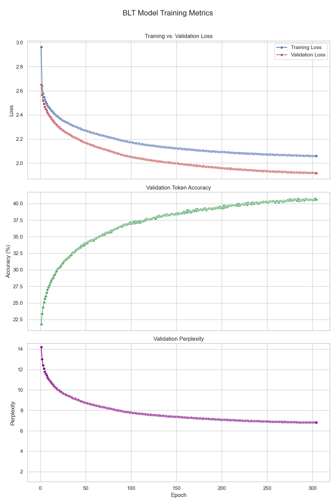

[](https://classroom.github.com/a/-JGnMZcd)

# LMA Assignment 1: BLT vs. Traditional Transformer for String Reversal

This repository contains the code and results for Assignment 1 of the CL3410: Language Models and Agents course at IIIT Hyderabad (October 2025). The project implements and evaluates a simplified Byte-Latent Transformer (BLT) against a standard character-level Transformer baseline on a string reversal task.

## Objective

The primary goal was to compare the performance and potential computational efficiency of the BLT model, which uses entropy-based patching and hash n-gram embeddings, against a traditional character-level Transformer.

## Task: String Reversal

Given an input string containing printable ASCII characters, the task is to predict the reversed version of the string.

**Example:**

* **Input:** `LMA is fun!`
* **Output:** `!nuf si AML`

## Models Implemented

### 1. Baseline Model (Character-Level Transformer)

* **Tokenization:** Standard character-level using printable ASCII (plus PAD, SOS, EOS tokens).
* **Architecture:** Transformer Encoder-Decoder (`d_model=64`, `nhead=4`, 2 Encoder layers, 2 Decoder layers).
* **Training:** Trained for ~470 epochs with AdamW (lr=1e-3).

### 2. Byte-Latent Transformer (BLT)

* **Tokenization:**
    * **Entropy Patching:** Input strings are dynamically split into patches using a sliding window (`window_size=12`). A split occurs if window entropy exceeds `2.5` or patch length exceeds `20`.
    * **Hash N-gram Embedding:** Each patch is represented by summing the embeddings of its 1, 2, and 3-grams. Embeddings (`embed_dim=64`) are looked up from tables using hashing (`4096` buckets per n-gram size).
* **Architecture (1-1-2):**
    * 1 Transformer Encoder block processes patch embeddings (prepended with a global token).
    * 2 Transformer Encoder blocks act as a Global Transformer on the latent representation.
    * 1 Transformer Decoder block generates the character-level output.
    * `d_model=64`, `nhead=4`, `dropout=0.1`.
* **Training:** Trained for 372 epochs with Adam (lr=1e-4).

## Repository Structure

```
├── data/
│   ├── test.csv
│   └── train.csv
├── src/
│   ├── checkpoints/          # BLT model checkpoints
│   ├── checkpoints_baseline/ # Baseline model checkpoints
│   ├── predictions/          # Prediction CSVs (created by prediction script)
│   ├── main.ipynb            # Jupyter Notebook containing all the code
│   ├── training_log_BLT.txt  # Console output saved from BLT training runs
│   ├── training_log_base.txt # Console output saved from Baseline model training runs
│   └── training_metrics_plot.png
├── .gitignore                # Specifies intentionally untracked files that Git should ignore
├── README.md                 # This file
├── Report.pdf                # Final evaluation report PDF
└── requirements.txt          # Project dependencies
```

## Setup & Usage

The core implementation and experiments are contained within the `main.txt` (converted from `.ipynb`). Key steps include:

1.  **Data Loading:** Reads `train.csv` and `test.csv` from `data/`.
2.  **Model Definition:** Defines the `PatchEmbedder`, `BLTModel`, `BaselineCharTransformer`, `Dataset`, and helper functions.
3.  **Training:** Contains the `train_blt` and `train_baseline` loops. Set MPS precision if applicable: `torch.set_float32_matmul_precision("high")`.
4.  **Prediction:** Code to load checkpoints and generate `predictions_BLT.csv` and `predictions_normal.csv`.
5.  **Evaluation:** Script to calculate accuracy and sequence lengths from prediction files.
6.  **Plotting:** Code to generate training graphs from logs or checkpoints.

*(Dependencies: PyTorch, Pandas, Matplotlib, Seaborn, tqdm)*

## Results Summary

| Metric                               | Baseline Model  | BLT Model        |
| :----------------------------------- | :-------------- | :--------------- |
| **Token Accuracy (%)** | **97.77%** | **8.39%** |
| Avg. Input Length (chars)            | 70.85           | 70.85            |
| Avg. Predicted Output Length (chars) | 70.85           | 78.03            |
| **Avg. Sequence Length (Test)** | **70.85 chars** | **6.36 patches** |

## Training Curves (BLT Model)


*Figure 1: BLT model training metrics over 372 epochs. Validation metrics plateaued around epoch 300.*

*(See `Report.pdf` for full details)*

## Conclusion

The standard character-level Transformer baseline significantly outperformed the implemented BLT model on the string reversal task. While the BLT successfully reduced sequence length through patching, its accuracy plateaued at a low level. The pre-processing overhead and convergence difficulties suggest that, for this specific task and implementation, the BLT approach was less effective than the simpler baseline. Potential reasons include insufficient model capacity (`d_model=64`) or loss of positional information during patching/embedding.

## Links to Saved Models

* [Final BLT Model (blt_epoch372.pt) & Baseline Model (char_transformer_epoch500.pt)](https://drive.google.com/drive/folders/1BIsIaQ5GCVY-t-xp34LlR9IR8gN2eVGx?usp=share_link)
